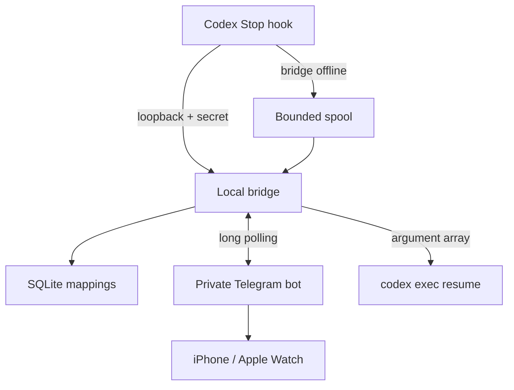

# Codex Telegram Watch Bridge

A Windows-first local bridge that sends private Codex `Stop` notifications to Telegram and routes a Telegram text reply—including text produced by Apple Watch Dictation—back to the exact saved Codex session.

## What is implemented

- Loopback-only Fastify API authenticated with a generated shared secret.
- Fast Stop-hook adapter with a 1.5 second default timeout and bounded atomic spool.
- Telegram Bot API long polling through grammY; both private `user_id` and `chat_id` are required.
- SQLite event deduplication and Telegram message-to-Codex-session mappings.
- Safe `codex exec resume --json <SESSION_ID> <PROMPT>` spawning with `shell: false`, discrete arguments, and live JSONL progress rendering in the bridge terminal.
- Explicit-reply-first routing, safe ambiguity handling, per-session lock, and global queue limit.
- Completion-only Telegram notifications, failure alerts, and `/jobs` history with redacted prompt previews.
- Startup recovery that marks abandoned queued/running jobs as interrupted instead of leaving stale status behind.
- Setup, doctor, reversible user hook installer, and optional Windows Scheduled Task commands.
- Offline unit/integration tests with fake Telegram and fake Codex implementations.

Persistence uses Node's built-in `node:sqlite` API instead of a native addon. This keeps Windows installation simple and avoids post-install compilation; some supported Node releases may still print an experimental API warning even though the required calls are covered by the test suite.

The current official Codex documentation confirms the Stop-hook JSON stdin shape, user-level `~/.codex/hooks.json`, hook review/trust through `/hooks`, and the `codex exec resume <SESSION_ID>` command. Transcript parsing remains best-effort because Codex documents that transcript format as unstable.

## Quick verification

Requires Node.js 22.5 or later (Node 22+ is recommended by the product PRD).

```powershell
npm install
npm run lint
npm run typecheck
npm test
npm run build
```

Then follow [docs/SETUP_EN.md](docs/SETUP_EN.md) or [docs/SETUP_TH.md](docs/SETUP_TH.md). Never commit the runtime `.env`, Telegram bot token, database, spool, or logs.

## Architecture



## Security model

- No public inbound port and no Telegram webhook.
- The HTTP service rejects non-loopback binding at configuration validation.
- Telegram updates must match both configured numeric IDs.
- Telegram text is never interpreted as a command line; it is one Codex prompt argument.
- Codex authentication, sandboxing, rules, and approvals are inherited. This project includes no bypass or auto-approval flags.
- Full raw prompts are not stored. Job history keeps a SHA-256 hash plus a bounded, whitespace-normalized preview after known secret patterns are replaced with `[REDACTED]`.
- Secrets and prompt fields are redacted from structured logs.

## Important limitations

- No real Telegram, iPhone, Apple Watch, or Codex account is used by automated tests. Complete the real-device checklist before calling the installation end-to-end verified.
- Work resumed externally updates the saved Codex session, but an already-open Codex Desktop view may not live-refresh on every app version. Reopen the task if needed.
- Voice-note audio transcription is out of scope. Use Apple Watch Dictation so Telegram sends normal text.
- Approval-required Codex actions can still require an official Codex surface; the bridge never bypasses approvals.
- Global user hooks can notify for every project. Project allow/deny filtering can be added after the first controlled device test; per-session mute is included now.

## Apple Watch command flow

When there is more than one recent Codex session, send `/sessions`, then `/use 1` (or another listed number). Send the command as normal Telegram text after that. Use `/clear` to forget only the saved target; the bridge then requires an explicit `/use` before accepting another floating command.

Use `/clearall` to remove every saved session and Telegram reply mapping from the bridge. This does not delete real Codex tasks, transcripts, or `/jobs` history. Floating commands remain unavailable until a new Codex completion arrives through the Stop hook. The command refuses to run while a resume job is queued or running.

Run the bridge in a visible PowerShell window during a demo. The terminal renders live, human-readable events from `codex exec --json`, including commands, file changes, tool calls, agent messages, and the final turn status. Reasoning events are deliberately omitted, and displayed values pass through secret redaction.

Do not open a second interactive `codex` process expecting it to mirror the bridge run. It is a separate CLI client and session. The visible `npm.cmd run start` window is the realtime viewer for work launched by Telegram.

Telegram stays quiet while Codex works. The trusted Stop hook sends the final “what was completed” summary; the bridge sends an additional Telegram message only when the run fails. Use `/jobs` or `/history` to inspect the five most recent commands and their stored state.

A Scheduled Task runs hidden, so it keeps the Watch workflow available but does not provide a visible live terminal. Stop the hidden bridge before starting a visible demo instance to avoid a port conflict.
